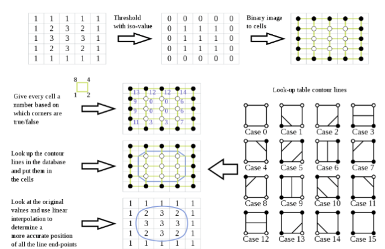
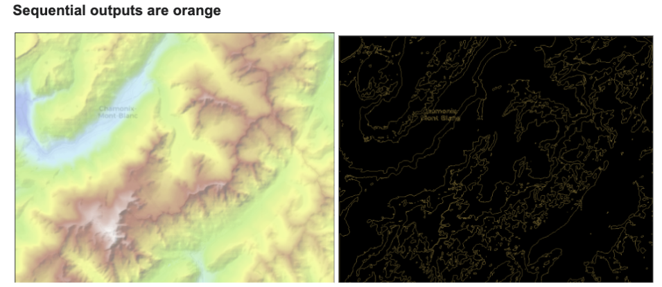
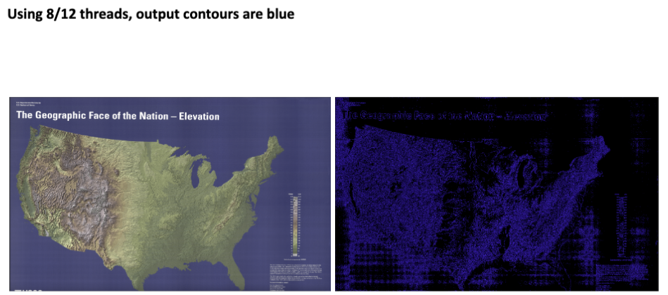
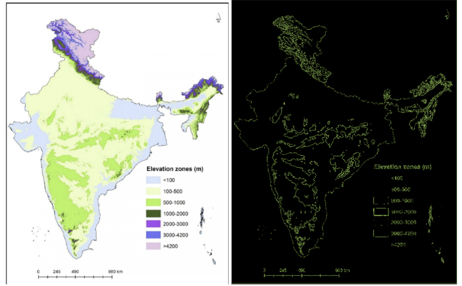
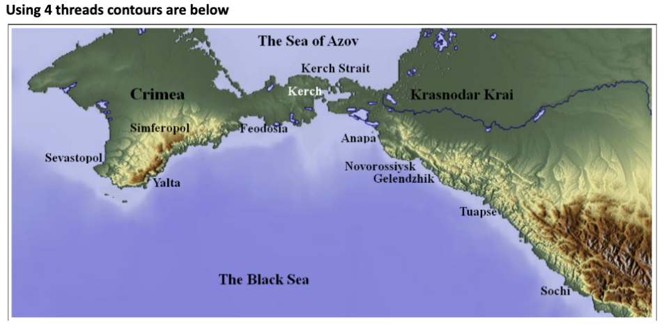
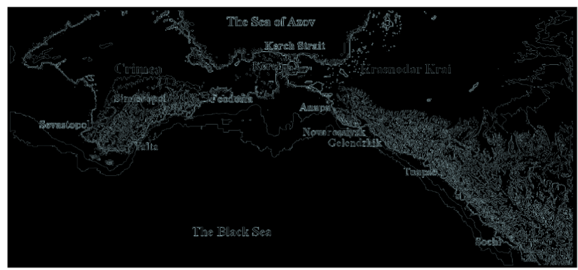
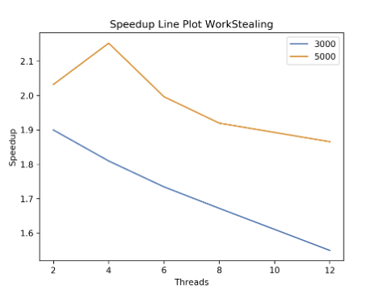
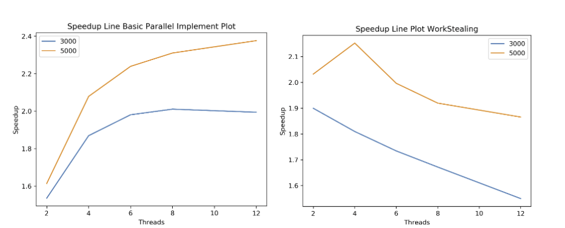

# Parallel Contour Generation for 2D Images with Workstealing

## Problem & Description

This project focuses on enhancing image processing efficiency through parallel programming techniques. The task involves generating contours for 2D images using the Marching Squares algorithm. Two primary implementations were developed:

1. **Basic Parallel Implementation**: This approach processes 12 images in parallel by dividing each image into chunks corresponding to the number of threads. Each chunk is processed by the Marching Squares algorithm, and the results are combined to form the final image.
2. **Work-Stealing Refinement**: In this method, 12 images are distributed among a work-stealing queue with a specified number of worker threads. Each worker processes images sequentially within its queue. When a worker's queue is empty, it steals tasks from other workers.

## Instruction

1. **Download Images**: Obtain the required images from [this link](https://drive.google.com/drive/folders/16DubqDaRR3zWRFkYLO1zHUVxbFD7WVo8?usp=sharing) and place them in the `/data/in/` directory of the project.
2. **Run the Script**: Execute the command `sbatch benchmark-proj3.sh` inside the `benchmark` directory. Ensure `plot_graph.py` is in the same directory. This command will:
   - Run the experiment five times.
   - Collect the best execution times.
   - Automatically pass the SLURM job ID to `plot_graph.py` to generate performance graphs.
3. **Output**: The processed images will be saved in the `/data/out/` directory. Speedup graphs will be stored in the `benchmark` directory.

## RESULTS

Tabular results are in csv file called Csv Parallel Programming3.csv in proj3/benchmark
Below attaching images of generated contours

## Challenges

1. **Implementing Custom WaitGroup**: Initially, I faced challenges with initializing the mutex in the custom struct, which is crucial for thread synchronization.
2. **Downloading Images**: Although it seems straightforward, I wrote a custom script to download images and store them in the specified directory efficiently.
3. **Synchronization Overhead**: Managing synchronization among multiple threads was particularly challenging in the work-stealing implementation, leading to performance bottlenecks.

## Testing

The project was rigorously tested by executing the provided script multiple times to ensure the reliability of results. Performance metrics were collected and stored in CSV files, with graphs generated for visual analysis. The results showed consistent patterns, validating the effectiveness of both implementations.

## Hotspots & Bottlenecks

- **Hotspots**:
  - **Basic Parallel Implementation**: The main hotspot was dividing the image into chunks and processing each chunk in parallel using the Marching Squares algorithm. This approach maximizes parallelism at the chunk level.
  - **Work-Stealing Implementation**: The hotspot here was distributing images among worker threads and efficiently managing the task-stealing mechanism to balance the workload.
- **Bottlenecks**:
  - **Sequential Image Processing**: In the basic parallel implementation, images were processed sequentially, creating a bottleneck.
  - **Synchronization Overhead**: In the work-stealing implementation, the overhead associated with synchronizing multiple threads trying to steal tasks became a significant bottleneck.

## Analysis & Limitation

- **Basic Parallel Implementation**: Showed a steady increase in speedup with more threads, achieving a maximum speedup of approximately 2. This implementation is straightforward and efficient for a moderate number of threads.
- **Work-Stealing Implementation**: Demonstrated initial speedup improvements but faced diminishing returns as the number of threads increased. The main limitation was the synchronization overhead among threads, which led to reduced performance gains at higher thread counts.
- **Limitations**: Both implementations are limited by the processing power of the system and the efficiency of task distribution mechanisms. The work-stealing approach, in particular, is sensitive to the overhead of managing idle threads and task stealing.

## Comparison

- **Basic Parallel Implementation**:

  - Processes images sequentially, dividing each image into multiple chunks processed in parallel.
  - Shows consistent speedup improvements with increasing thread counts, making it suitable for systems with moderate parallelism needs.
  - Simplicity in implementation and predictability in performance scaling.

- **Work-Stealing Implementation**:
  - Distributes images among worker threads, with each thread processing images sequentially within its queue.
  - Initially faster due to efficient load distribution, but speedup decreases with more threads due to synchronization overhead.
  - More complex implementation, but can handle dynamic workloads effectively by redistributing tasks from idle to busy threads.
  - Demonstrates a higher initial speedup (~2.1) but faces challenges with thread synchronization and context switching at higher thread counts.
    
    

## Interesting Questions

- **Q0: Why the BSP approach is the most appropriate.**

  Ans0: I used BSP as I just wanted to mimic a Waitgroup as my barrier as I wait for other
  threads to finish processing on their individual chunks. As for load balancing for the work
  stealing queue I equally balanced the amount of images given to each thread only once in
  the beginning. After that as soon as their worker queue size got 0 they would steal

- **Q1:Other challenges I faced while implementing the system. What aspects of the system make it difficult to parallelize?**

  Ans1:
  Some of the challenges I faced during implementing the system were:

  1. Implementing CustomWaitgroup:
     I was stuck for some time as I didn't initialize the mutex in the custom struct
  2. Downloading Images:
     While this may not seem complex, I actually wrote a custom script to
     download images from the net and would store them in a directory

- **Q2: Did the usage of a task queue with work stealing improve performance?**

  Ans2: The usage of task queue showed speedup with all the different thread values we
  used, but the trend was after 4 threads, the speedup decreased b/w subsequent thread
  values, as can be seen below. I think it was because of the context switches and overhead
  required b/w handling many threads all trying to steal once their work queue was 0 size.

- **Q3: What are the hotspots (i.e., places where you can parallelize the algorithm) and bottlenecks in sequential program? Was I able to parallelize the hotspots and/or remove the bottlenecks in the parallel version?**

  Ans3: Yes, in my sequential program, the hotspots were dividing the image into chunks and
  processing the MS algorithm on them and recombining the results. This I solved in the
  basic Parallel implementation.
  The bottleneck was also that each image was processed sequentially, and this was handled
  in the workstealing implementation.
  I tried combining the basic parallel and workstealing implementation into one, but realized
  that would mean we generate T\*T threads per program run and even though Go can
  handle so many threads, other languages like C/C++ may not be able to and so abandoned
  that implementation. I was seeing decreasing speedup in that.

- **Q4:What limited speedup? Is it a lack of parallelism? (dependencies) Communication or synchronization overhead?**

  Ans4: I think the limit on speedup is caused by the processing power, and also depends on
  the randomized victim we choose once a worker has an idle queue. For the basic parallel
  implementation, maybe we could've also processed images parallely along with parallel MS
  implementation. That can be an avenue to higher speedup.
  For the workstealing queue implementation I can see clearly that synchronization overhead
  for a higher number of threads who are trying to steal randomly is causing decreasing
  speedup. This is evident from the graphs across all 4 jobs I ran and attached below.

- **Q5: Comparing the two parallel implementations, Are there differences in their speedups?**

  Ans5: The Basic Parallel implementation takes N images, Processes them sequentially. On
  each image I, it divides it into T chunks and processes them parallely, recombining them
  later after all chunks done and joins them to produce result.
  The workstealing queue takes N images, divides the images amongst T worker threads, and
  each worker thread applies sequential MS on each image in their bounded dequeue. If
  their queue size is 0 then they will randomly try to steal from another worker thread, their
  image.
  Difference in speedup graph is evident.
  The speedup for basic parallel implementation starts low but increases as expected with
  higher number of threads i.e. more chunks solvable parallely, reaching maximum of ~2
  12
  The speedup for Workstealing starts high around 1.8-1.9 with thread number 4, it increases
  to almost ~2.1 then decreases steadily as higher threads are provided. This is due to
  suspected synchronization overhead amongst multiple threads trying to steal from
  compatriots.

Overall, both implementations offer valuable insights into parallel programming techniques and their impact on performance in image processing tasks. The choice between them depends on the specific requirements of the application, such as the desired level of parallelism and the system's capabilities.
